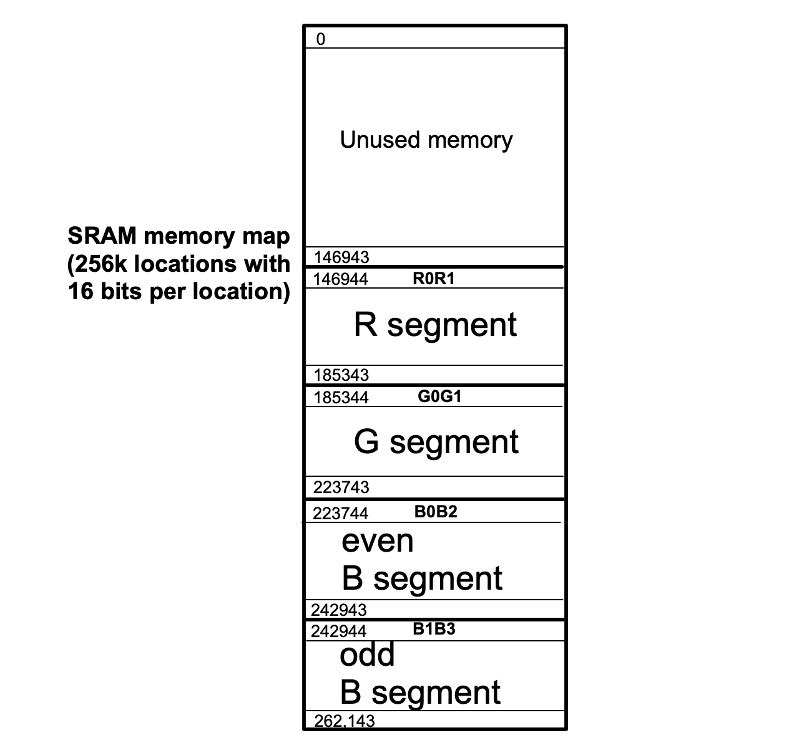

### Exercise

Implement the state machine that displays the same image as __experiment 1__, when accounting for the following changes to the memory layout. 

|  |
|:--:|
|**Figure 10** – The segmented memory map for this take-home exercise |

The external SRAM memory is organized in four memory segments, as shown in Figure 10 above. 

* The first memory segment stores all the R values (the “R segment”)
* The second memory segment stores all the G values (the “G segment”)
* The third memory segment stores all the even B values (the “even B segment”)
* The fourth memory segment stores all the odd B values (the “odd B segment”)

The "R segment" starts at 146,944 and it has 38,400 memory locations. The first location from the R segment stores the red color values for pixels 0 and 1. The second location from the R segment stores the red color values for pixels 2 and 3, and so on. The same principle holds for the "G segment" that starts at location 185344.

The number of memory locations in each of the two B segments (odd and even) is 19,200 (their starting addresses are provided in the above figure). The first location from the "even B segment" stores the blue color values for pixels 0 and 2. The second location from the "even B segment" stores the blue color values for pixels 4 and 6, and so on. The first location from the "odd B segment" stores the blue color values for pixels 1 and 3. The second location from the "odd B segment" stores the blue color values for pixels 5 and 7, and so on. 

It is **critical** to note that the starter code from the `exercise/rtl` sub-folder already writes the image from __experiment 1__ into the SRAM (using the SRAM fill states) that follows the memory map described in the figure above.  Your task is to **_modify_** the **_read_** states (which are left unmodified from the FSM from __experiment 1__) in order to account for the change in the memory map from the figure above. 

Submit your sources and in your report write approx half-a-page (but not more than full-page) that describes your reasoning. Your sources should follow the directory structure from the in-lab experiments (already set-up for you in the `exercise` folder); note, your report (in `.pdf`, `.txt` or `.md` format) should be included in the `exercise/doc` sub-folder. Note also, your design must pass compilation in Quartus before you simulate it and you write the report.

For your group's deadline please check the top-level [README](../../README.md) file. Late submissions will be penalized.
